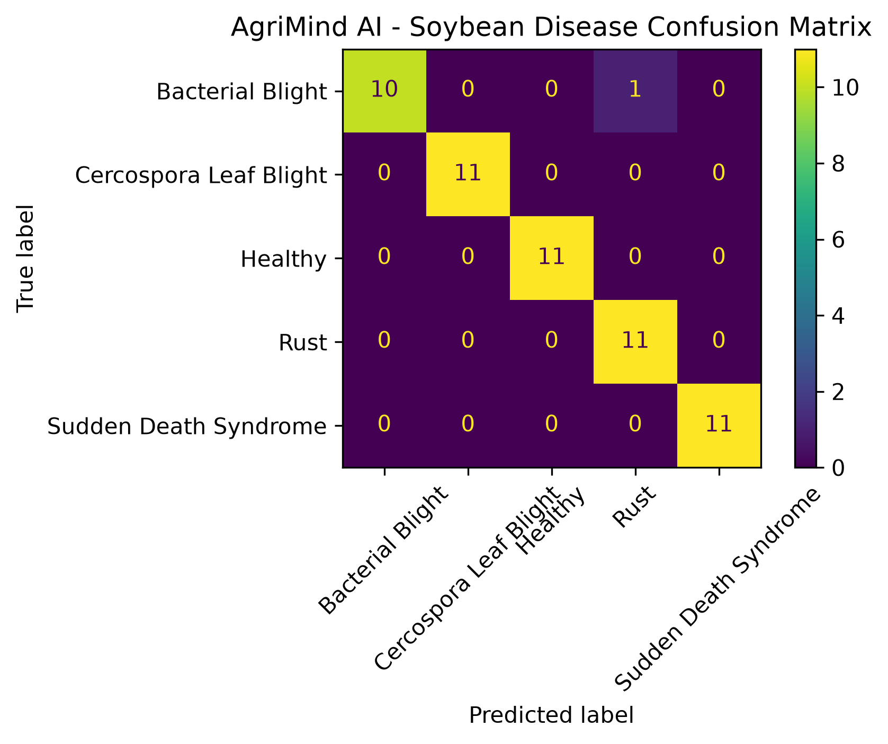
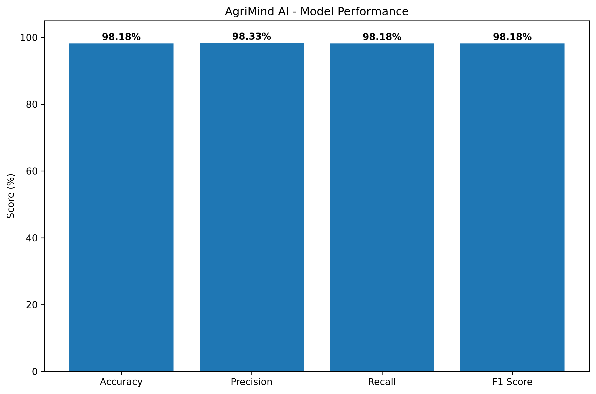

# AgriMind AI - Model Evaluation Report

## 1. Model Information

| Parameter | Value |
|---|---|
| Project | AgriMind AI |
| Crop | Soybean |
| Model | EfficientNet-B0 |
| Input Image Size | 224 × 224 |
| Number of Classes | 5 |
| Test Images | 55 |

## 2. Disease Classes

The model classifies soybean leaf images into the following five classes:

1. Bacterial Blight
2. Cercospora Leaf Blight
3. Healthy
4. Rust
5. Sudden Death Syndrome

## 3. Test Performance

| Metric | Score |
|---|---:|
| Accuracy | 98.18% |
| Precision | 98.33% |
| Recall | 98.18% |
| F1 Score | 98.18% |

## 4. Confusion Matrix

The confusion matrix shows the relationship between the actual disease class and the predicted disease class.

The model correctly classified:

- 10/11 Bacterial Blight images
- 11/11 Cercospora Leaf Blight images
- 11/11 Healthy images
- 11/11 Rust images
- 11/11 Sudden Death Syndrome images

One Bacterial Blight image was incorrectly classified as Rust.

## 5. Interpretation

The EfficientNet-B0 model achieved 98.18% accuracy on the 55-image soybean test set.

The results indicate strong classification performance across the five supported classes.

## 6. Evaluation Reports

### Confusion Matrix

### Model Performance

## 7. Conclusion

The evaluated AgriMind AI soybean disease classification model demonstrates strong performance on the available test dataset.

The model can identify five soybean leaf conditions:

- Bacterial Blight
- Cercospora Leaf Blight
- Healthy
- Rust
- Sudden Death Syndrome

Final test accuracy: **98.18%**.